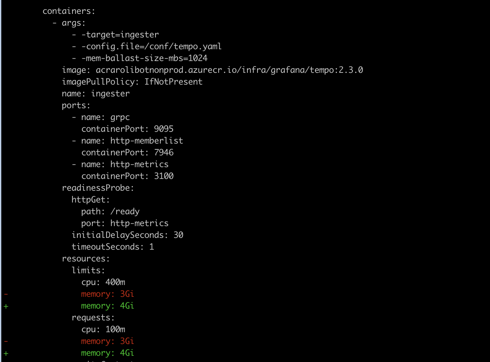

import Tabs from '@theme/Tabs';
import TabItem from '@theme/TabItem';

`helm diff` is a Helm plugin that shows differences between a Helm chart's current state
in Kubernetes and its new configuration. This is helpful for previewing what changes will happen
in a cluster before deploying them, allowing for safer updates by visually inspecting the intended
modifications. The plugin highlights added, modified, and deleted resources, making it easier to
understand the impact of changes. 

## How to install

### On a computer with internet access

`helm plugin install https://github.com/databus23/helm-diff`

### On a computer without internet access

Assuming that you're working on your Windows workstation in the Outnet you can install the plugin
by copying a few files into your `HELM_PLUGINS` directory.

* Go to the `helm-diff` gitlab repo.
* Clone the `helm-diff` gitlab repo to your workstation.
* In the root directory you'll find a directory called `tar-gz`, `cd` into this directory.
* Extract the `helm-diff-windows-amd64.tgz`
* Find out what's the `HELM_PLUGINS` path configured on your computer by running `helm env`, in the out output you'll find all the helm env vars, copy the path.
* If the `HELM_PLUGINS` doesn't exist create it.
* Create a directory `helm-diff` under the `HELM_PLUGINS` path.
* From the extracted `tgz` file, copy the `bin` directory and the `plugin.yaml` into the `HELM_PLUGINS`/`helm-diff` directory.

Now you have `helm-diff` plugin installed on your Windows workstation.

## How to use it

Assuming that your chart name is `foo` and your values file name is `dev-values.yaml`
run the following from the Chart directory you wish to upgrade.  
`helm diff upgrade foo --values dev-values.yaml .`  
You can also specify multiple values files:  
`helm diff upgrade foo --values dev-values.yaml --values dev1-values.yaml .`  
If there's a difference, the output will show all the diffs between the k8s objects which will be modified/create/deleted.  

Here's an example of the `helm diff` output

