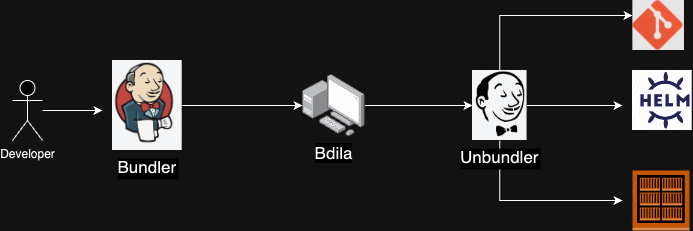
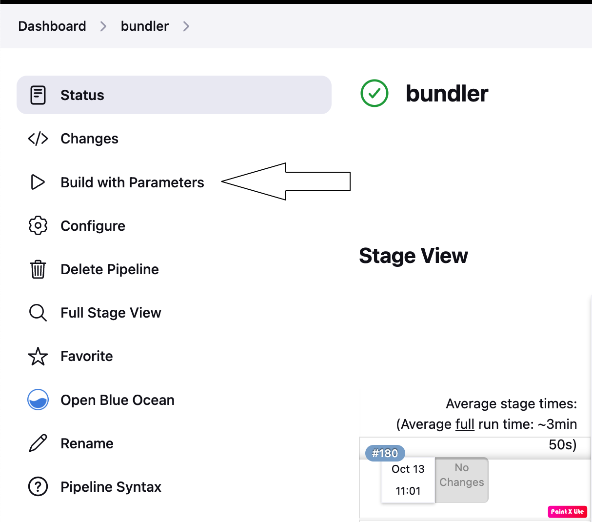
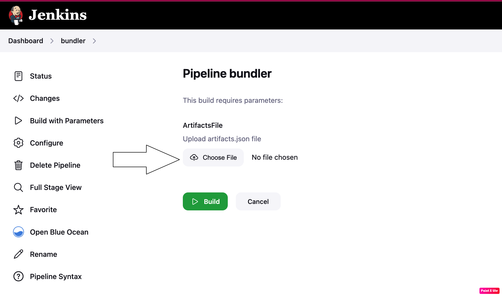
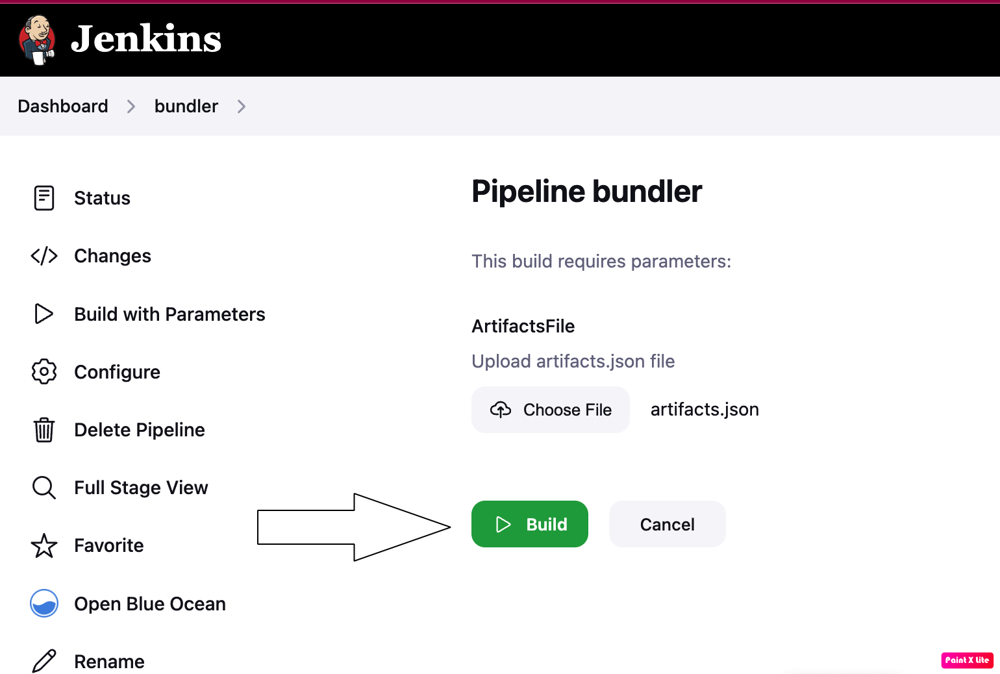
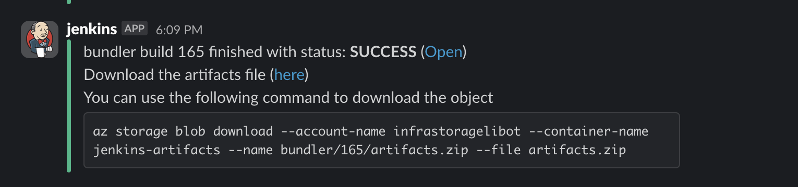
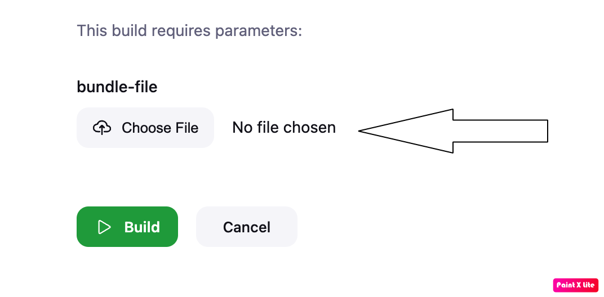

import Tabs from '@theme/Tabs';
import TabItem from '@theme/TabItem';
 

## Bundler/Unbundler
 
 

### Bundler pipeline

The [bundler pipeline](https://jenkins.mapcolonies.net/job/bundler/) has 1 parameter which is the `artifacts.json` file.

Here's an example of the `artifacts.json` 


```json
{
  "docker": {
    "acrarolibotnonprod.azurecr.io": {
      "3d-gateway": "v2.4.2",
      "store-trigger": "v1.5.2"
    },
    "docker.io": {
      "bitnami/redis": "7.2.3",
      "timonwong/uwsgi-exporter": "latest"
    }
  },
  "helm": {
    "acrarolibotnonprod.azurecr.io": {
      "gateway": "2.4.2",
      "store-trigger": "1.5.2"
    },
    "https://charts.bitnami.com/bitnami": {
      "redis": "18.5.0"
    }
  },
  "git": [
    "MapColonies/helm-charts"
  ]
}
```  

In order to trigger the [bundler pipeline](https://jenkins.mapcolonies.net/job/bundler/) you'll need to follow the steps below:  

* Go to the bundler pipeline
* Click on `Build with parameters`  

* Click on `Choose File` and upload the `artifacts.json` from you local computer.  

* Click the Build button

* After the bundler will finish it'll send a slack message to the `<team>-notifications` channel based on the user logged in.

* Click on the download link in the slack message and download the bundle zip file which you'll use later on in the unbundler in the relevant network.


### Unbundler pipeline

In order to trigger the unbundler, open the jenkins instance in the relevant network where you want to to unbundle and click on the unbundler pipeline and follow the steps bellow.

* Click on `Build with Parameters`
* Click on `Choose file` and select the bundler zip file from your computer

* Click the `build` button
* Once the bundler is done you'll be able to find all the artifacts which were in the bundle zip file in all the registries in the specific network you're working on.
