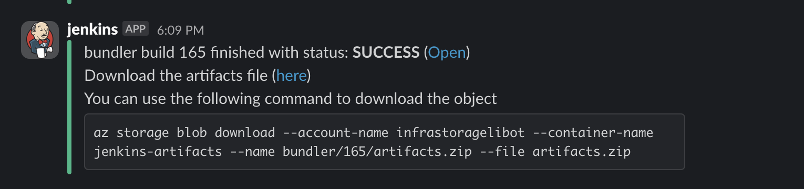

import Tabs from '@theme/Tabs';
import TabItem from '@theme/TabItem';


The bundler and unbundler workflows are intended to help our dev team to bring in the artifacts which were built in the release flow in an easy way to our internal deployments.

We utilize Jenkins for the bundler and unbundler. 


 

## Bundler pipeline

The [bundler pipeline](https://jenkins.mapcolonies.net/job/bundler/) has 1 parameter which is the `artifacts.json` file.

Here's an example of the `artifacts.json` 


```json
{
  "docker": {
    "acrarolibotnonprod.azurecr.io": {
      "3d-gateway": "v2.4.2",
      "store-trigger": "v1.5.2"
    },
    "docker.io": {
      "bitnami/redis": "7.2.3",
      "timonwong/uwsgi-exporter": "latest"
    }
  },
  "helm": {
    "acrarolibotnonprod.azurecr.io": {
      "gateway": "2.4.2",
      "store-trigger": "1.5.2"
    },
    "https://charts.bitnami.com/bitnami": {
      "redis": "18.5.0"
    }
  },
  "git": [
    "MapColonies/helm-charts"
  ]
}
```  

The bundler pipeline will bundle all the artifacts (docker tar balls, helm packages, git repos) into 1 zip file.

Once the bundler is done it'll send a slack message to the `<team>-notifications` channel based on the user logged in.



## Unbundler pipeline

The unbundler pipeline is happening in other networks we have.
After copying over the `bundle` file to the relevant network, there will be an unbundler pipeline on the jenkins.

The unbundler pipeline is performing the following:

* For each docker tar ball it'll attempt to push the docker image with the same tag to all the docker registries available in all the sites.
* For each helm package it'll attempt to push the helm package with the same version and name to all the helm registries available in all the sites.
* For each git repository it'll attempt to open a PR/MR from the source `master` branch to the destination repository internally to the `master` branch.
