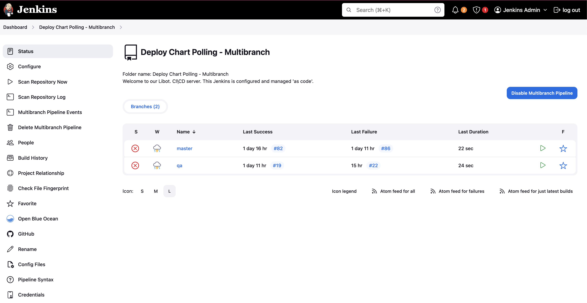
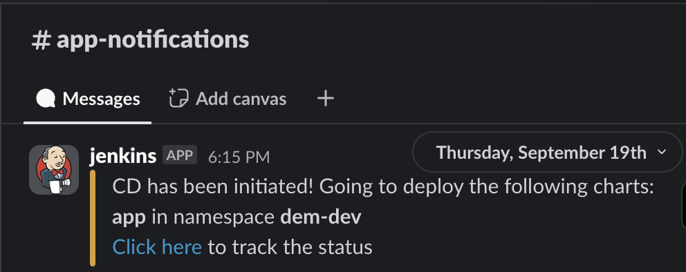

import Tabs from '@theme/Tabs';
import TabItem from '@theme/TabItem';


The CD (Continuous deployment) is responsible for deploying the images built in the CI.  
We're utilizing [Jenkins](https://jenkins.mapcolonies.net/) for the deployment pipelines.

### How to login?

Each team has their own set of credentials which they can use to login to the jenkins instance.

We have 2 options for deployment:

1. Manual deployment
2. Auto Deploy

### Auto deployment

The auto deployment process is currently monitoring the following branches: `master` and `qa`. On each commit to the [helm-charts repository](https://github.com/MapColonies/helm-charts) on the monitored branch the pipeline is kicking off.

The pipeline can be found [here](https://jenkins.mapcolonies.net/job/Deploy%20Chart%20Polling%20-%20Multibranch/).  
As you can see in the overview page of the pipeline there are 2 branches which it's monitoring.

  

#### How the auto deploy pipeline is working?

* The pipeline is first of all looking at changes introduced in each commit with a `git diff`.
* After finding the `diff` it'll look at the `deployment.json` in the `scope` (each team's directory in the `helm-charts` repo) directories.
* Here's an example of `deployment.json` file.

```json
[
    {
      "chartLocation": "3d/charts/ingestion",
      "valuesFile": ["3d/charts/global-values.yaml", "3d/charts/ingestion/ingestion-values.yaml"],
      "namespace": "3d-dev",
      "releaseName": "ingestion-3d",
      "skip": false
    },
    {
      "chartLocation": "3d/charts/serving",
      "valuesFile": ["3d/charts/global-values.yaml", "3d/charts/serving/serving-values.yaml"],
      "namespace": "3d-dev",
      "releaseName": "serving-3d",
      "skip": true
    }
  ]
```  

* If you wish to skip a deployment you'll need to have `"skip": true` in the chart you wish to skip.
* When the pipeline will start it'll send a slack message to the `<team>-notifications` channel based on chart location(s) which are going to be deployed.  
 
* After the pipeline will finish it'll send another message to the `<team>-notifications` channel based on chart location(s) which have been deployed with the status of the deployment.  
