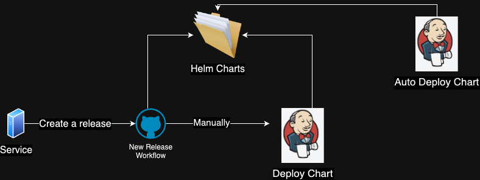

import Tabs from '@theme/Tabs';
import TabItem from '@theme/TabItem';

## Overview

The CI (Continues Integration) pipelines are responsible for validating, compiling and building the artifacts and publishing them to the various registries.

## Background

We store all our helm charts of all the teams under the [helm-charts repository](https://github.com/MapColonies/helm-charts)

This repository is a mono repo, where each team has it’s own `scope`. For example, `3D` team has it’s own directory where the team is storing their helm charts.  

<u>Here’s the repo structure:</u>    
```bash
- /
  - 3D/
    - Umbrella chart
    - deployment.json
    - artifacts.json
  - raster/
    - Umbrella chart
    - deployment.json
    - artifacts.json
```

## Release Workflow



The release workflow begins with a new release or tag push on each service repository and is executed using Github Actions workflows.

The workflows are being triggered automatically.  
If we take a look at a sample repo `store-trigger` it has a workflow called `Build and push artifacts` , where the source of this can be found [here](https://github.com/MapColonies/store-trigger/blob/master/.github/workflows/build-and-push.yaml)

The workflow is building the docker image of the service, tagging it and pushing it to `Azure ACR`. Along with the docker image the flow also builds and pushes the helm package which is part of the repository.  
Afterwards it's updating the `artifacts.json` which is associated with the team's `scope` under the [helm-charts repository](https://github.com/MapColonies/helm-charts) with the new releases which have been just released.  
